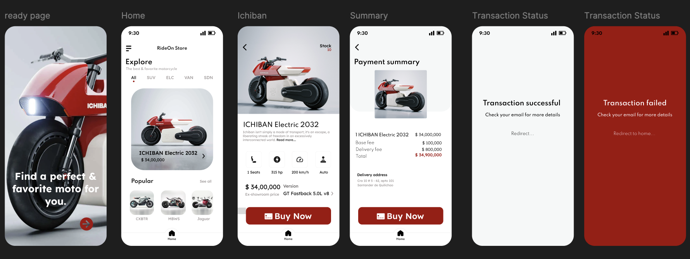

# Ride On Store - SPA

## Description

Ride On Store is a single-page application (SPA) designed to provide users with an optimal shopping experience for motorcycle products. The application features a responsive design that adapts to various screen sizes, ensuring a seamless experience on both mobile and desktop devices. Users can interact with different elements on the page, view detailed information about each product, and navigate through the site with ease. The project leverages modern web development technologies to deliver a fast, intuitive, and visually appealing user interface.

## Table of contents

- [Overview](#overview)
  - [The challenge](#the-challenge)
  - [Screenshot](#screenshot)
  - [Links](#links)
- [My process](#my-process)
  - [Built with](#built-with)
  - [Continued development](#continued-development)
- [Author](#author)


## Overview

### The challenge

Users should be able to:

- View the optimal layout for each of the website's pages depending on their device's screen size
- View each page and be able to toggle between the tabs to see new information
- Perform a simulated purchase of a product using a payment gateway that connects with the backend to process the transaction

### Screenshot

Figma design and prototype



See prototype [RideOnFigma](https://www.figma.com/proto/0u8Y1IWCmSeOcaLjY1z7xr/Untitled?node-id=1-337&t=MX5aRKe3jrLd8139-1&scaling=min-zoom&content-scaling=fixed&page-id=0%3A1)

### Links

- Ride On Shop URL: [RideOn](https://github.com/untalinfo/space-tourism-react)
- Ride On Shop Frontend URL: [GitHub](https://github.com/untalinfo/ride-on-store)
- Ride On Shop Backend URL: [GitHub](https://github.com/untalinfo/ride-on-store-backend)

## My process

### Built with

- React and Redux toolkit [JS library](https://reactjs.org/)
- CSS custom properties
- Flexbox
- CSS Grid
- Sass
- Mobile-first workflow
- React Hook Form

### Testing

The application has been thoroughly tested using Jest and Testing Library. These tools ensure that the components render correctly and the user interactions work as expected. Unit tests cover individual functions and components, while integration tests verify that different parts of the application work together seamlessly.

#### Commands

To view the test coverage, run the following command:

```bash
yarn test --coverage
```

To run the tests, use the following command:

```bash
yarn test
```
### Continued development

I will continue adding more transitions and animations that are more fluid and consistent with the style of the page.


## Author

- LinkedIn - [Oscar Info](https://www.linkedin.com/in/untalinfo/)